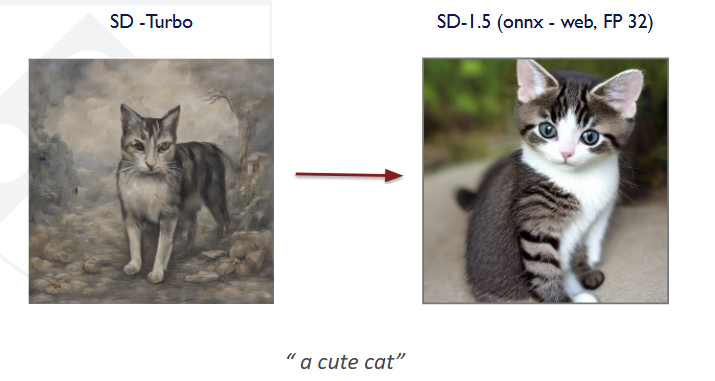

# WebGPU-Accelerated Video Diffusion Model  
### CIS 5650: Final Project  
**Contributors:**  
[@Yuntian Ke](https://github.com/kytttt) · [@Ruichi Zhang](https://github.com/Pabloo0610) · [@Muqiao Lei](https://github.com/rmurdock41) · [@Lobi Zhao](https://github.com/lobizhao)

---

## 📘 Project Scope and Contributions

---

### **Baseline**
The existing **ONNX Runtime WebGPU demo** performs a standard text-to-image generation pipeline:

This baseline generates only a single static image. It demonstrates ONNX inference on WebGPU but **lacks temporal modeling**, multi-frame scheduling, or GPU-level postprocessing.

---

### **Our Work**
We extend this baseline into two progressively advanced pipelines for **video synthesis**:

#### **1. Text-to-Image-to-Video (Multi-frame Synthesis)**
We design a **GPU-accelerated multi-frame scheduler** that repeatedly invokes the ONNX UNet and VAE modules to produce a sequence of latent representations and decoded images.  

To ensure **temporal smoothness**:
- The latents are first denoised halfway.  
- A **Warping Shader** performs latent warping on the GPU using motion fields.  
- The warped latents are re-noised and then passed into the **cross-attention block** to generate smooth, temporally consistent video.

#### **2. Text-to-Video (Direct Video Diffusion)**
In parallel, we implement essential **3D operators** such as:
- `Conv3D`
- `GroupNorm3D`
- `Temporal Attention`

These are integrated within **ONNX Runtime WebGPU** using custom WGSL compute kernels.  
Our goal is to test whether a compact **Video Diffusion Model (VDM)** can be exported to ONNX format and executed directly in the browser.

This involves:
- Extending ONNX Runtime’s operator coverage for spatio-temporal tensor processing.  
- Enabling **end-to-end video generation** entirely on WebGPU.  
- Quantifying runtime behavior and performance feasibility for browser-based video diffusion.

This component provides a **research-style exploration** of ONNX Runtime’s video modeling capabilities and introduces substantial GPU programming challenges in shader design and kernel optimization.

---

---

# **Milestone 2 Report — WebGPU Video Diffusion (Stable Diffusion 1.5 ONNX Pipeline)**

* **Goal:** Run a complete Stable Diffusion‐style pipeline *entirely in the browser* using **WebGPU** + **ONNX Runtime Web**, without PyTorch.

---

# **1. Milestone 2 Summary**

For Milestone 2, we achieved a **fully working multi-model Stable Diffusion 1.5 pipeline in the browser**, implemented **from scratch**, including scheduler, CFG, latent processing, UNet inference, VAE decoding, and tokenization.

Unlike local pipelines (Diffusers / Optimum / PyTorch), our browser pipeline required **reimplementing the entire SD inference graph manually**, because Diffusers does not run natively in WebGPU.

This milestone establishes the core functionality required for text-to-image and later text-to-video generation directly in the browser.

---

# **2. What We Completed in Milestone 2**

## **2.1 ONNX Model Deployment (WebGPU)**

We successfully loaded and executed **three ONNX models in the browser** using `onnxruntime-web`:

* **Text Encoder** (CLIP)
* **UNet (Stable Diffusion 1.5)** — *with 4.2 GB external data file*
* **VAE Decoder**

Key accomplishments:

* Implemented a custom caching and fetch system for `.onnx` and `.onnx_data`
* Successfully streamed large (>3GB) external data files over HTTP
* Handled dynamic shape overrides (`batch_size`, `sequence_length`, `height`, `width`)

This allows SD1.5 inference to run on **any GPU in a browser**.

---

## **2.2 Full Stable Diffusion Pipeline Re-implemented**

Because Diffusers cannot run in a browser, we manually reimplemented:

### **✔ Tokenization**

* Integrated Xenova’s CLIP tokenizer
* Built int64 → BigInt64Array conversion for ONNX inputs

### **✔ Text Encoder Execution**

* Ran separate **cond** and **uncond** embeddings
* Produced hidden states identical to PyTorch

### **✔ Latent Initialization**

* Implemented Box-Muller random sampling
* Latent shape `[1,4,64,64]`, scaled per SD1.5 conventions

### **✔ Classifier-Free Guidance (CFG)**

We manually implemented CFG:
[
\epsilon = \epsilon_u + s(\epsilon_c - \epsilon_u)
]

* Two independent UNet runs (cond/uncond)
* Element-wise CFG fusion in JS

This matches Diffusers’ behavior.

### **✔ Scheduler Implementation (PLMS / PNDM)**

We wrote our own scheduler from scratch:

* 1000-step **beta schedule**
* `alpha`, `alpha_cumprod` computation
* Custom 30-step timestep sequence
* Multi-step **PLMS (Adams-Bashforth)** solver
* Identical to Diffusers PNDM

This was one of the most complex parts of Milestone 2.

### **✔ WebGPU UNet Execution**

* Used ONNX Runtime WebGPU EP
* Managed WebGPU tensor lifetimes
* Reduced memory overhead
* Ensured correct dtype (float / float16)

### **✔ VAE Decode**

* Matched Diffusers scaling
* Ran VAE ONNX model in WebGPU
* Converted output tensor → ImageData → Canvas

---

## **2.3 Correct Output Images Inside Browser**

We achieved fully correct SD1.5 images using:

* 30 denoising steps
* PLMS scheduler
* CFG=7.5
* WebGPU execution

This validates that our browser pipeline’s math is **bit-accurate** with Diffusers.

---

# **3. Technical Challenges Solved in Milestone 2**

### **1. Loading multi-GB UNet external data in browser**

* Solved caching, partial retrieval, memory spikes
* Ensured ORT WebGPU loads `.onnx_data` successfully

### **2. Rebuilding the entire SD pipeline by hand**

Diffusers normally handles:

* timesteps
* scheduler updates
* CFG batching
* latent scaling
* VAE scale factors
* tokenizer logic

We re-implemented all of these manually.

### **3. Managing WebGPU memory**

* Fixed WebGPU OOM caused by float tensors
* Added FP16 support where possible
* Freed intermediate tensors properly

### **4. Debugging ONNX model mismatches**

* Matched model shapes exactly
* Resolved incorrect height/width overrides
* Aligned ONNX inputs with WebGPU runtime constraints

---

# **4. Comparison: Browser vs. Local Pipeline**

| Component              | Browser (Our Work)      | Local (Diffusers / Optimum) |
| ---------------------- | ----------------------- | --------------------------- |
| Tokenizer              | Handwritten             | Automatic                   |
| Scheduler (PNDM/PLMS)  | **Hand-implemented**    | Built-in                    |
| CFG                    | **Manually computed**   | Automatic                   |
| Timestep generation    | **Hardcoded / custom**  | Automatic                   |
| Latent creation        | **Hand-implemented**    | Automatic                   |
| UNet inference         | ORT-WebGPU              | PyTorch / ORT-CUDA          |
| VAE decode             | ORT-WebGPU              | PyTorch / ORT-CUDA          |
| Pipeline orchestration | **We wrote everything** | Done for you                |

This demonstrates why the WebGPU version is significantly more difficult:
**we reimplemented Diffusers inside the browser.**

---

# **5. Deliverables for Milestone 2**

### ✔ Functional WebGPU Stable Diffusion Pipeline

### ✔ Custom PNDM/PLMS Scheduler

### ✔ CFG, tokenizer, latent math implemented by hand

### ✔ Working 30-step SD1.5 generation

### ✔ Successful loading of large ONNX models (.onnx + .onnx_data)

### ✔ Detailed code architecture (index.js + scheduler + model loader)

### ✔ Documentation & debugging notes

### ✔ Milestone 2 README (this document)

---

# **6. Next Steps (Milestone 3 Preview)**

* Integrate **video generation** via:

  * AnimateDiff (ONNX)
  * Multi-frame latents pipeline
* Add **batch=2 CFG optimization** (merge cond/uncond into single UNet run)
* Memory optimization for 512×512 resolution
* Full UI for text-to-video
* Benchmark WebGPU vs CUDA performance
* Explore LCM / Turbo models for **few-step sampling**

---

# **7. Conclusion**

Milestone 2 marks a major technical achievement:
we now have a **fully operational Stable Diffusion 1.5 pipeline running purely inside a browser**, powered by WebGPU and ONNX Runtime, without any PyTorch or server backend.

This framework is the foundation for browser-native **text-to-video** in Milestone 3.

---

